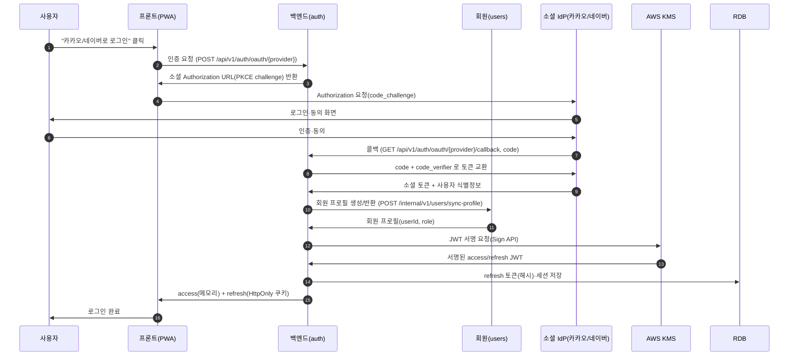
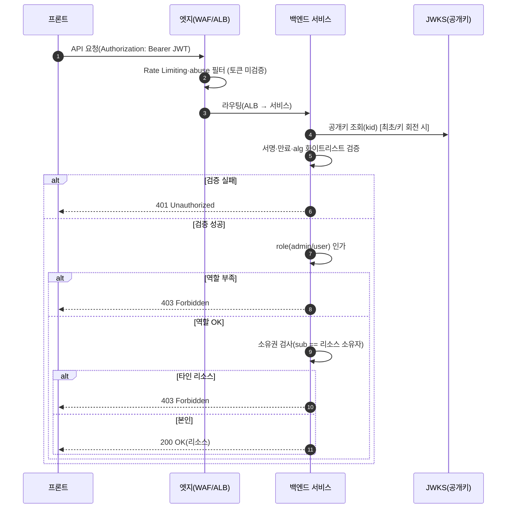
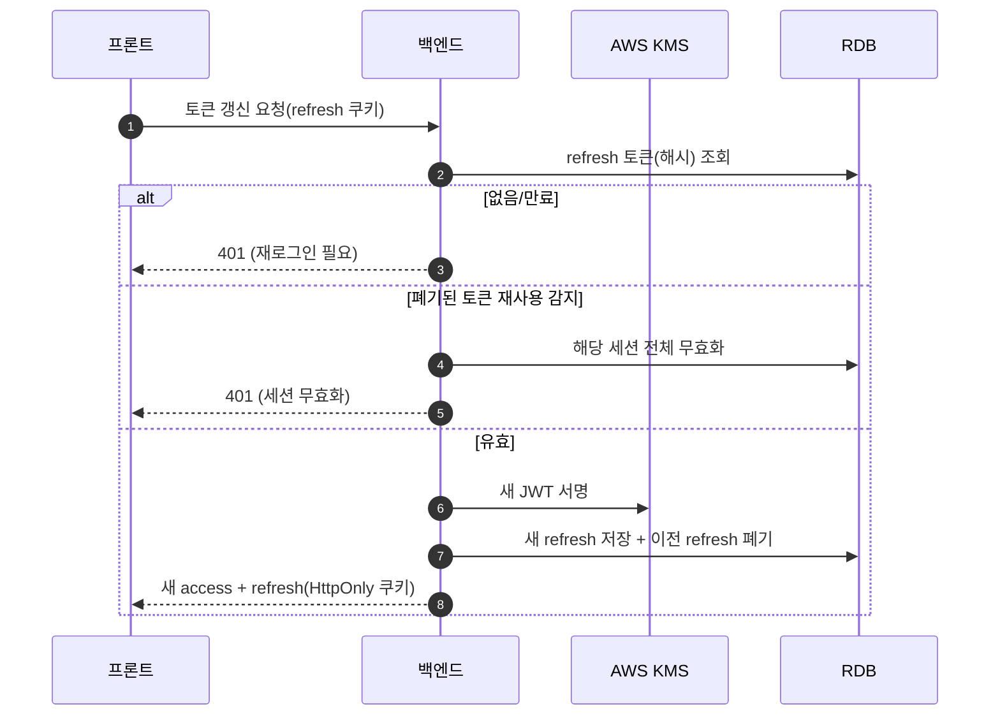
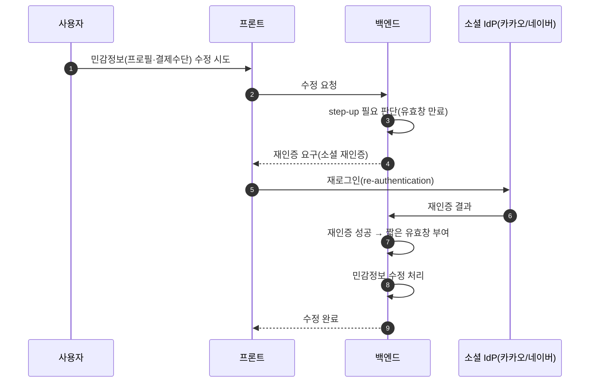

# 인증/인가 설계서 — 전자상거래 플랫폼

| 항목 | 내용 |
|---|---|
| 작성 | 보안팀 |
| 대상 | 개발팀(백엔드) — 프론트팀·인프라팀 관련 부분 별도 표시 |
| 상태 | v2.1 (WAF 도입, 게이트웨이 1차 점검 미도입, 부록(시퀀스다이어그램) 수정) |
| 후속 | `/internal/*` 격리 요구 개발팀 전달 |
| 범위 | 인증/인가 공통 규칙(프레임워크) 정의. 기능별 세부 권한 매핑은 개발팀이 본 규칙에 따라 API 명세서에 정의 |

---

# 0. 문서 개요

## 0.1 목적

본 문서는 전자상거래 플랫폼의 **인증(Authentication)·인가(Authorization) 공통 규칙**을 정의한다. 개별 기능마다 인증/인가를 설계하는 문서가 아니라, **어떤 기능이든 따라야 할 표준**을 정하는 문서다. 개발팀은 본 규칙에 따라 각 기능을 구현한다.

## 0.2 범위 — 3계층 구조

인증/인가를 요청 흐름상 위치에 따라 세 계층으로 나눠 정의한다.

1. **클라이언트 ↔ 백엔드 인증** (섹션 1) — 사용자가 누구인지 확인
2. **사용자 인가** (섹션 2) — 사용자가 무엇을 할 수 있는지 판단(RBAC/ABAC)
3. **내부 서비스간 인증/인가** (섹션 3) — 서비스 간 신뢰(NetworkPolicy 기반 접근 통제)

## 0.3 용어 정의

| 용어 | 정의 |
|---|---|
| 인증(Authentication) | "누구인가"를 확인. 로그인·토큰 검증이 해당. |
| 인가(Authorization) | "무엇을 할 수 있는가"를 판단. 권한 체크가 해당. |
| RBAC | 역할 기반 접근 제어(Role-Based). 역할(admin/user)에 권한을 부여. |
| ABAC | 속성 기반 접근 제어(Attribute-Based). 리소스 소유자 등 속성으로 판단. |
| JWT | 서명된 토큰 형식. payload로 신원을, 서명으로 정당성을 보증. |
| IdP | 신원 공급자(Identity Provider). 여기서는 카카오·네이버. |
| NetworkPolicy | K8s에서 파드(서비스) 간 통신을 허용/차단하는 네트워크 접근 제어. |

## 0.4 전제 조건

- **도메인**: 전자상거래 플랫폼. 회원가입 후 배송지·계좌정보 등 개인정보 수정 기능 존재.
- **인증 스코프**: 카카오/네이버 소셜 로그인(OAuth2) 전용, 로컬 회원가입 없음.
- **역할**: admin / user 2종.
- **클라이언트**: 웹앱(PWA), 반응형(모바일·태블릿), iOS(HIG) 디자인 기준. 백엔드 API는 웹/앱 공통.
- **인프라 환경(인프라팀 구성 기준 — 본 설계가 참고하는 스택)**: AWS · EKS 기반.
  - **진입 경로**: Route 53 → CloudFront(**S3 정적/이미지 캐싱 용도**) / 외부 HTTP·HTTPS 요청은 **ALB → EKS 내부 Ingress**. AWS API Gateway는 사용하지 않으므로, 인증/인가는 백엔드 진입부에서 처리(섹션 2).
  - **TLS 종료(확정)**: **ALB에서 ACM 인증서로 TLS 종료(Offloading)**. ALB 이후 내부 클러스터 구간은 프라이빗 VPC + NetworkPolicy로 통신(내부 재암호화 없음, 3.2 리스크 수용과 정합).
  - **네트워크 격리**: 서비스는 프라이빗 서브넷에 배치, 외부 직접 노출 없음. 서비스 간 통신은 **K8s NetworkPolicy**로 접근 통제(섹션 3.2, 확정).
  - **데이터 저장소**: 토큰/세션은 **RDB**로 관리. Redis는 캐시·임시데이터 용도(인증 저장소 아님).
  - **키 관리(KMS)**: JWT 서명키를 KMS로 관리(섹션 1.3.2). 저장 데이터 암호화용 CMK와는 별개 키.
  - **이벤트 브로커(RabbitMQ, 확정)**: **EKS 내부 배포(RabbitMQ Cluster Operator/Helm)**. 사용자 인증(TLS 상) + vhost·큐 권한 + TLS로 접근 통제(섹션 3.5).
  - **엣지 보안(WAF, 도입 확정·단계적 활성화)**: ALB 앞단 **AWS WAF로 엣지 1차 방어(DDoS·Rate Limiting 완화)**. 개발 단계 고정비 절감·초기 라우팅/디버깅 효율을 위해 **기본 인프라·서비스 연동 안정화 직후 활성화**. WAF/인프라는 **네트워크·요청 수 기반 1차 필터링만** 담당하고, JWT 검증·RBAC·세부 인가는 **백엔드 전담**(2.3). 외부 구간 TLS 적용.
  - **운영 관리자 접근(확정)**: **Tailscale(Mesh VPN/SSO)** 사설망 오버레이로 인가된 관리자만 클러스터 API·내부 서브넷 접근(Public Bastion 미노출). 접근 통제 세부는 사전 인프라 보안 요구사항서에서 관리(서비스 admin과 별개, 섹션 3.6).
- **컴플라이언스 전제**: 고유식별정보(주민번호 등) 미취급·정보주체 5만 미만 → 접속기록 1년 보관. (전제 변경 시 2년 재검토.)

---

# 전체 인증/인가 흐름 개요

요청이 흐르며 각 홉에서 무엇이 인증되고 인가되는지를 요약한다.

```
[사용자]
  │  ① 카카오/네이버 소셜 로그인(OAuth2 + PKCE)
  ▼
[백엔드]  ── 소셜 토큰 검증 → 자체 JWT(access/refresh) 발급 (KMS 서명)   ← 섹션 1 (인증)
  │  ② 이후 요청: 자체 access token(JWT) 첨부
  ▼
[백엔드 진입부(각 서비스)]  ── JWT 서명·만료 검증 → role(admin/user) 인가   ← 섹션 2 (인가)
  │  ③ 검증된 사용자 컨텍스트 전파
  ▼
[내부 서비스들]  ── NetworkPolicy 기반 접근 통제 + 소유권 기반 세밀한 인가(본인 리소스)   ← 섹션 2·3
  │
  ├─▶ [RDB] 토큰/세션 저장
  └─▶ [RabbitMQ] 서비스간 이벤트 (브로커 인증 + TLS)   ← 섹션 3

[운영 관리자] ── Tailscale VPN(SSO) → EKS·인프라 접속 (서비스 admin과 별개)   ← 섹션 3.6
```

| 홉 | 인증(누구인가) | 인가(무엇을 할 수 있나) |
|---|---|---|
| 클라이언트↔백엔드 | 소셜 로그인 → 자체 JWT | — |
| 백엔드 진입부(각 서비스) | JWT 서명·만료 검증 | role 기반 인가 |
| 서비스 내부 | (전파된 사용자 컨텍스트) | 소유권 기반 세밀한 인가 |
| 서비스↔서비스 | 네트워크 격리(NetworkPolicy) | 서비스 단위 접근 정책 |

> **인프라 매핑 참고**: 위 진입부는 **ALB → EKS 내부 Ingress**에 해당한다. **TLS는 ALB에서 ACM 인증서로 종료**되고, 이후 내부 구간은 프라이빗 VPC + NetworkPolicy로 통신한다. CloudFront는 S3 정적·이미지 캐싱 용도이며 동적 요청 진입 경로가 아니다. **WAF는 엣지 1차 방어(DDoS·Rate Limiting)로 도입하되 인프라 안정화 후 활성화**(네트워크·요청 수 필터링만 담당), **게이트웨이 계층 별도 인가는 두지 않고 JWT 검증·RBAC·세부 인가는 백엔드에서 처리**한다.
>
> 상세 시퀀스 다이어그램: **부록 참고** (개발팀 이해를 돕기 위한 참고 자료이며, 공식 규격 문서는 아님)

---

# 책임 경계 (RACI)

| 영역 | 보안팀 | 백엔드 | 프론트 | 인프라팀 |
|---|---|---|---|---|
| 인증/인가 규칙·정책 설계 | **책임** | 협의 | 협의 | 협의 |
| 서명·키 관리 정책(KMS) | **책임** | 구현 | — | 지원 |
| 토큰 발급·검증·갱신·무효화 | 설계 | **구현** | — | — |
| 접속기록 로깅 | 설계 | **구현** | — | — |
| 클라이언트 토큰 취급·저장 | 설계(준수사항) | — | **구현** | — |
| 사용자 인가 강제(역할·소유권) | 설계 | **구현** | — | — |
| 기능별 권한 매핑(엔드포인트) | 규칙 제공 | **정의(명세서)** | — | — |
| 서비스 간 통신 보호(NetworkPolicy) | 요구사항 | — | — | **책임** |
| 엣지(WAF·ALB·Ingress)·메시지 브로커 기반 | 요구사항 | — | — | **책임** |

핵심 원칙: 본 설계서는 **공통 규칙**을 정의하며, 기능별 세부 권한 매핑은 개발팀이 본 규칙에 따라 각 API 명세에 정의한다.

---

# 섹션 1. 클라이언트 ↔ 백엔드 인증

> 범위: **"사용자가 누구인지 확인"(인증)**만 다룬다. 권한(인가)은 섹션 2·3.

## 1.1 개요 및 적용 범위

- **인증 방식**: 카카오/네이버 **소셜 로그인(OAuth2/OIDC) 전용**. 로컬 회원가입 미지원.
- **적용 대상 클라이언트**: **웹앱(PWA)**, 반응형(모바일·태블릿), iOS(HIG) 기준. 데스크톱 웹 접속 시 모바일 이용 안내. 백엔드 API는 웹/앱 공통.
- **향후 확장**: 네이티브 앱 마이그레이션 가능성 → 전환 시 토큰 저장 전략 재검토(1.4).
- **핵심 원칙**: 백엔드는 자체 비밀번호를 저장하지 않는다 → 비밀번호 유출 리스크 원천 제거(보안상 강점).

## 1.2 인증 방식: 소셜 로그인 (OAuth2 / OIDC)

- **Grant Type**: Authorization Code Grant + PKCE.
- **역할 구분**: IdP(카카오·네이버) / 백엔드(소셜 토큰 검증 후 자체 토큰 발급) / 프론트(리다이렉트·자체 토큰 취급).
- **소셜 토큰 처리(확정)**: **백엔드 직접 처리.** 소셜 토큰 교환·자체 토큰 발급·세션 관리를 백엔드가 직접 수행(Cognito 등 관리형 미사용). 근거: 자체 KMS 서명 토큰 체계와 일관, 카카오/네이버가 Cognito 기본 제공자가 아님, 보안 정책을 직접 제어해 정확히 강제 가능.
- **로그인 시퀀스(개요)**
  1. 사용자가 "카카오/네이버로 로그인" 클릭
  2. 프론트 → 소셜 인증 화면 리다이렉트(Authorization Code + PKCE)
  3. 소셜 → 백엔드 콜백으로 code 전달
  4. 백엔드 → 소셜에 code로 토큰 교환, 사용자 식별정보 수신
  5. 백엔드 → 자체 access/refresh 토큰 발급, 세션/refresh 토큰 저장(RDB)
  6. 이후 요청은 자체 토큰으로 인증

## 1.3 토큰 설계

- **토큰 종류**: 소셜 토큰과 분리한 자체 발급 토큰(access / refresh).
- **형식**: JWT. **헤더에 `kid`(Key ID) 포함** — 키 회전 시 검증 측이 올바른 공개키 선택.
- **클레임**: `sub`(user ID), `role`(admin/user), `iat`, `exp`, `jti` 등. 최소 정보만, 민감정보 미포함.
- **만료 시간(확정)**
  - **access token: 30분**
  - **refresh token: 14일** (rotation 적용)

### 1.3.1 서명 알고리즘

- **서명 방식**: **비대칭 키(공개키/개인키) 서명** 확정. (대칭키 HS256은 다수 서비스가 비밀키를 공유해야 해 MSA 부적합.)
- **기본값(권고): ES256 (ECDSA P-256)** — 널리 채택, 크기 작고 빠름, KMS 네이티브 지원, 라이브러리 호환성 최상.
- **승인 대안(선택): EdDSA (Ed25519)** — AWS KMS가 2025.11부터 지원. 백엔드가 원하고 JWT 라이브러리가 EdDSA 검증을 지원하면 채택 가능. 미채택 시 기본값 ES256 사용(설계상 대기 아님).
- **비권장**: RS256(크고 느림), HS256(MSA 부적합).

### 1.3.2 서명 키 관리 (KMS 기반, 보안 필수)

- **키 보관**: 서명 개인키는 AWS KMS 내부에서 생성·보관, **외부 반출 금지**. 서명은 KMS Sign API로 수행.
- **공개키 배포**: JWKS 엔드포인트(`/.well-known/jwks.json`). 각 검증 주체는 공개키로 검증.
- **키 회전(확정)**: **6개월 주기**. KMS 비대칭 키는 자동 회전 미지원 → 수동 회전. `kid`로 키 식별, **회전 시 구 키 7일 병행 후 폐기**하여 무중단 전환.
- **접근통제(IAM)**: KMS Sign 권한은 **인증 서비스에만** 부여. 검증 서비스는 공개키만 필요.
- **검증 규칙**: 알고리즘 화이트리스트 강제(`alg: none`·알고리즘 혼동 공격 차단), `iss`·`aud`·`exp` 검증 필수.
- **참고**: 본 서명키(비대칭·수동 회전)는 저장 데이터 암호화용 CMK(사전 인프라 보안 요구사항서, 대칭·자동 회전)와 별개 키다.

## 1.4 토큰 저장 위치 (확정, 프론트 구현 기준)

- **access token: 메모리(JS 변수)** 보관 — 지속 저장 지양.
- **refresh token: `HttpOnly` + `Secure` + `SameSite` 쿠키.**
- **근거**: XSS·CSRF 동시 대응. localStorage 저장 금지.
- **PWA 주의**: 서비스 워커가 인증 토큰·개인정보 응답을 **캐시하지 않도록** 설정.
- **네이티브 전환 시**: 보안 저장소(iOS Keychain / Android Keystore)로 재검토 `[향후]`.

## 1.5 토큰 갱신

- **Refresh Token Rotation**: 갱신 시마다 새 refresh token 발급, 이전 토큰 폐기.
- **재사용 감지**: 폐기된 refresh token 재사용 시 해당 세션 전체 무효화.
- **저장소(확정)**: refresh token/세션을 **RDB에 저장**(비용 절감) → 서버 측 강제 무효화 가능.
- **저장소 준수 요건**
  1. refresh token은 **원본이 아닌 해시로 저장** — DB 유출 시에도 재사용 불가.
  2. **만료 토큰 정리** — RDB는 자동 TTL 없음 → 배치/스케줄로 만료 레코드 삭제.
  3. 로그아웃·유휴 만료 시 **즉시 무효화** 가능하도록 조회·삭제 경로 확보.
- **참고**: access token은 stateless JWT라 매 요청 검증 시 저장소 미조회 → 저장소 접근은 로그인·갱신·로그아웃 시로 한정, RDB 부하 관리 가능.

## 1.6 로그아웃 및 세션 무효화

- **명시적 로그아웃**: refresh token/세션을 RDB에서 제거.
- **유휴 세션 자동 차단(확정)**: 일반 **user 30분**, 서비스 **admin 15분** 미사용 시 세션 무효화(토큰 갱신 차단).
  - 법적 근거: 「개인정보의 안전성 확보조치 기준」제6조(접근 통제) — 유휴 접속 차단.
- **관리자 권한 구분**: 본 문서의 `admin`은 **서비스(앱) 사용자 역할**(상품 관리 등)이며, 위 유휴 15분은 이 서비스 admin 세션에 적용된다. **EKS·인프라에 접속하는 운영 관리자 권한과는 별개 영역**으로, 운영 관리자는 사전 인프라 보안 요구사항서에서 관리한다(3.6 참조).

## 1.7 보안 고려사항

- **전송 구간**: 전 구간 TLS.
- **비밀번호 미저장**: 소셜 전용 → 자체 비밀번호 없음(강점).
- **접속기록 로깅**: 로그인/로그아웃/토큰 갱신 등 인증 이벤트 기록. 법적 근거: 동 기준 제8조 — **1년 보관**, 월 1회 이상 점검.
- **인증 실패 제한**: 연속 실패 시 제한/차단(동 기준 제5조) — 특히 admin.
- **토큰 탈취 대응**: 짧은 access 만료 + refresh rotation + 서버측 무효화.

## 1.8 법적 근거 ↔ 설계 규칙 매핑

| 설계 규칙 | 법적 근거 | 비고 |
|---|---|---|
| 유휴 세션 자동 차단(user 30분/admin 15분) | 안전성 확보조치 기준 제6조 | 보안팀 확정값 |
| 인증 이벤트 접속기록 1년 보관·점검 | 동 제8조 | 전제 변경 시 2년 |
| 인증 실패 제한/계정 잠금 | 동 제5조 | admin 강화 |
| 인증정보·토큰 보호(암호화·전송) | 동 제7조 | 서명키 KMS |
| 구체 토큰 규칙(만료·저장·갱신) | (법 아님) OWASP·RFC | 보안팀 확정 |

## 1.9 클라이언트(프론트엔드) 구현 준수사항

> 인증은 프론트-백엔드가 한 쌍으로 동작하므로, 프론트가 반드시 지켜야 할 항목만 모아 프론트팀에도 공유한다.

- **로그인 흐름**: Authorization Code + PKCE로 소셜 인증 시작.
- **access token**: 메모리에만 보관, `Authorization` 헤더 전송. localStorage/sessionStorage 저장 금지.
- **refresh token**: HttpOnly 쿠키(백엔드가 설정)라 JS 접근 불가 — 프론트는 직접 다루지 않음.
- **PWA 서비스 워커**: 인증 토큰·개인정보 응답 캐시 제외.
- **CSRF 대응**: `SameSite` 쿠키 준수, 필요 시 CSRF 토큰(백엔드 규격).
- **로그아웃**: 메모리 토큰 폐기 + 백엔드 로그아웃 API 호출.
- **전송 보안**: 모든 호출 HTTPS.

## 1.10 민감정보 수정 시 재인증 (Step-up) 

- **배경**: 개인정보(프로필)·결제수단·계좌 등 **민감 정보 수정 전 본인 재확인**이 필요(기능 명세서 US-AUTH-005). 단 본 서비스는 **소셜 로그인 전용·로컬 비밀번호 미저장**(1.1)이므로 **"비밀번호 검증" 방식은 성립하지 않는다.** → 비밀번호가 아닌 **step-up 재인증**으로 설계한다. (BE 의도 확인: 본인 재확인 목적 맞음.)
- **확정 방식: 소셜 IdP 재인증** — 카카오/네이버로 **재로그인(re-authentication)** 을 요구해 본인 확인.
  - **사유**: 기존 소셜 인증 정보 기반 계정이므로, **추가 개인정보(연락처 등) 수집 없이 동일한 인증 수단으로 본인 확인** → UX 향상.
  - **대안(미채택)**: 인증 메일/문자(OTP) — 별도 연락처 수집·발송 체계가 필요해 현 시점 미채택. 향후 필요 시 재검토.
- **공통 보안 요건**
  - 재인증 성공 후 **짧은 유효창(권고 5~10분)** 내에서만 민감 수정 허용(재사용 방지).
  - 재인증 이벤트를 **접속기록에 로깅**(1.7·법적 근거 제8조).
- **적용 대상**: 프로필 개인정보 수정, 결제수단·계좌 등록/변경 등 민감 액션. 구체 대상 엔드포인트는 API 명세서와 함께 확정(2.5 연계).

---

# 섹션 2. 사용자 인가 (RBAC / ABAC)

> 범위: 인증된 사용자가 **무엇을 할 수 있는지** 판단. 섹션 1 인증 이후 단계.

## 2.1 인가 모델

두 축을 결합한다.

- **① 역할 기반(RBAC)**: 역할은 **admin / user 2종**. 역할로 거친(coarse) 권한을 가른다. (예: admin 전용 기능 vs 일반 기능.)
- **② 소유권 기반(ABAC 성격)**: user는 **본인 소유 리소스만** 접근(배송지·계좌·주문 등). 역할이 2종뿐이라 "남의 주문을 못 본다"는 역할만으로 표현 불가 → 소유권 규칙이 실질적 핵심.

## 2.2 권한 판단 방식

- **역할 판단**: JWT 클레임 `role`로 판단(섹션 1.3 연계). 매 요청 DB 조회 없이 검증된 토큰에서 추출.
- **소유권 판단**: **토큰 `sub`(user ID)와 리소스 소유자 ID를 비교.** 일치 시에만 접근 허용. (admin은 소유권 검사 예외 처리 가능 — 정책으로 명시.)
- 표준화: 소유권 검사를 공통 로직(공통 모듈/필터)으로 두어 각 API가 개별 구현하지 않도록 권고. (보안 요구는 "소유권 검사 수행"까지 — 모듈화 방식은 **백엔드 구현 재량**.)

## 2.3 인가 강제 지점 (PEP)

> **전제**: 인가 로직(역할·소유권) 자체는 본 설계의 필수 구성이다. 인프라 현황상 전용 AWS API Gateway가 없고 인증/인가는 **백엔드 직접 처리**로 확정되었으므로, 강제 지점은 아래로 수렴한다. 게이트웨이 계층 별도 인가는 두지 않는다.

- **역할 인가(admin/user)**: **각 백엔드 서비스 진입부**에서 role 기반으로 차단(역할 검사는 비즈니스 로직 이전 수행).
- **소유권 인가**: 리소스를 다루는 **각 서비스(백엔드) 내부**에서 강제 — 진입부는 리소스 소유자를 모르므로.
- **정책 엔진(OPA 등)**: 역할 2종·소유권 비교 수준의 단순 모델이라 **초기엔 애플리케이션 내 구현으로 충분**, 별도 PDP 도입은 불필요(후속 복잡도 증가 시 재검토).
- **별도 게이트웨이 1차 JWT 검증 계층은 두지 않는다.** 엣지 abuse·Rate Limiting은 **WAF**가 담당하되, **WAF는 토큰을 모르므로 인증/인가를 대체하지 않는다** — JWT 검증·역할·소유권은 각 백엔드 서비스가 수행(필수). 인그레스/ALB는 라우팅·TLS만 담당.

## 2.4 인가 실패 응답

- **401 Unauthorized**: 인증 실패(토큰 없음·만료·서명 불일치).
- **403 Forbidden**: 인증됐으나 권한 없음(역할 부족·타인 리소스 접근).
- 에러 응답 포맷(JSON 구조 등)은 **백엔드 API 규약으로 결정**. 보안 요구는 401/403 의미 구분 + **실패 사유 과다 노출 금지**까지(그 이하 포맷은 재량).

## 2.5 엔드포인트별 권한 매핑 (API 명세서 v0.2 기준)

- 개발팀 API 명세서(Notion)의 endpoint를 기준으로 매핑을 작성했다. 명세서의 **Auth 컬럼**과 **소유권 확인 컬럼**을 본 설계 규칙에 정합시킨 결과이며, 개발팀이 작성한 인증/인가 처리표와도 일치 확인.
- **최근 반영 이력**: 상품 단순 조회 Auth 해제(Public)·개인화 home-recommendations만 User 유지 / 인증 `oauth/login` → `oauth/{provider}` + `oauth/{provider}/callback` 분리 / 회원 `internal/v1/users/sync-profile` 추가 / 주문 결제·확정 `place-order`·주문서 생성 `checkout` 경로 정리 / 내부 endpoint 다수 추가(모두 Internal).
- **Auth 컬럼 → 본 설계 해석**: `Public` 또는 `(공백)`→비인증 공개(인증 미요구) / `User`→user 역할(회원) / `Admin`→admin 역할 / `Internal`→서비스 간 내부 호출(회원 토큰 미사용, 3.3·3.4, **공개 엣지(ALB/Ingress) 미노출**). 명세서가 상품 단순 조회의 Auth를 비워둔 것은 인증 미요구(공개)를 뜻한다.
- 도메인명은 서비스 구획이지 역할이 아니다(역할은 user·admin 2종).

> 아래 표는 **API 명세서 원문 그대로**(PATH·기능 상세·Auth·소유권 확인)를 옮긴 것으로, endpoint 1건당 1행이다. Auth/소유권 값은 명세서 표기를 따른다.

### 인증/인가

| METHOD | PATH(endpoint) | 기능 상세 | Auth | 소유권 확인 |
|---|---|---|---|---|
| POST | /api/v1/auth/oauth/{provider} | 소셜 로그인 및 회원가입 | Public | 불필요 |
| GET | /api/v1/auth/oauth/{provider}/callback | 소셜 로그인 콜백처리 | Public | 불필요 |
| POST | /api/v1/auth/admin/login | 백오피스 관리자 로그인 | Public | 불필요 |
| POST | /api/v1/auth/refresh | access token 재발급 | Public | 불필요 |
| POST | /api/v1/auth/logout | 로그아웃 처리 | Admin,User | 불필요 |

### 회원

| METHOD | PATH(endpoint) | 기능 상세 | Auth | 소유권 확인 |
|---|---|---|---|---|
| GET | /api/v1/users/me/profile | 기본 주문자 정보 및 배송 요청사항 조회 | User | 불필요 |
| GET | /api/v1/users/me/addresses | 배송지 목록 조회 | User | 불필요 |
| POST | /api/v1/users/me/addresses | 신규 배송지 등록 | User | 불필요 |
| PATCH | /api/v1/users/me/addresses/{address_id}/default | 특정 배송지를 기본 배송지로 설정 | User | 필요 |
| POST | /internal/v1/users/sync-profile | 로그인 후 회원 프로필 생성 / 반환 | Internal(User,Admin) | 불필요 |

### 상품

| METHOD | PATH(endpoint) | 기능 상세 | Auth | 소유권 확인 |
|---|---|---|---|---|
| GET | /api/v1/products/home-recommendations | 홈 화면(추천 탭)에 필요한 데이터 제공 |  | 불필요 |
| GET | /api/v1/products/categories | 카테고리 트리 조회. parent_id 기반 계층, type, 노출 순서를 포함 |  | 불필요 |
| GET | /api/v1/products | 상품 목록을 조회한다. 카테고리·가격·재고·상태·유형으로 필터링하고, 추천순·판매량순·신상품순 등으로 정렬한다. |  | 불필요 |
| GET | /api/v1/products/filters | 탭(가격, 카테고리, 브랜드 등) 및 하위 옵션별 필터링 옵션 제공, 현재 매칭 상품 수량(product_counts) 집계(Aggregation) 데이터 제공 |  | 불필요 |
| GET | /api/v1/products/{productId} | 단일 상품 상세를 조회한다. 상품 정보, 대표 카테고리 경로, spec, 미디어를 포함한다.(group-unit도 포함) |  | 불필요 |
| POST | /internal/v1/products/inventory/hold | 재고 선점 | Internal | 불필요 |
| POST | /internal/v1/products/inventory/release | 재고 복구 | Internal | 불필요 |
| POST | /internal/v1/products/inventory/confirm | 재고 확정 | Internal | 불필요 |
| POST | /internal/v1/products/batch-summary | 상품 조회 | Internal | 불필요 |

### 주문

| METHOD | PATH(endpoint) | 기능 상세 | Auth | 소유권 확인 |
|---|---|---|---|---|
| GET | /api/v1/orders | 내 주문 목록 조회 | User | 필요 |
| GET | /api/v1/orders/{orderId} | 주문 상세 조회 | User | 필요 |
| GET | /api/v1/carts | 장바구니 조회 | User | 필요 |
| PUT | /api/v1/carts/delivery-address | 장바구니 배송지 변경 및 배송 약속 재조회 | User | 필요 |
| POST | /api/v1/orders/place-order | 주문 결제 요청 및 주문 확정 | User | 필요 |
| POST | /api/v1/orders/{orderId}/cancel | 고객 전체 주문 취소 신청 | User | 필요 |
| POST | /api/v1/orders/{orderId}/returns | 전체 주문 반품 신청 | User | 필요 |
| POST | /api/v1/orders/checkout | 주문서 생성 및 논리 재고 예약 | User | 필요 |
| GET | /api/v1/orders/cancellations-returns | 취소·반품 내역 조회 | User | 필요 |
| GET | /api/v1/orders/{orderId}/returns/preview | 반품 접수 정보 조회 | User | 필요 |
| GET | /internal/v1/orders/{orderId}/items | 재고 확정용 주문 품목 조회 | Internal | 불필요 |
| GET | /internal/v1/orders/{orderId} | 결제 검증용 주문 조회 | Internal | 불필요 |

### 결제

| METHOD | PATH(endpoint) | 기능 상세 | Auth | 소유권 확인 |
|---|---|---|---|---|
| POST | /api/v1/payments/checkout | 결제 승인 요청 | User | 필요 |
| POST | /api/v1/payments/{payment_id}/cancel | 결제 취소 요청 | User | 필요 |
| GET | /api/v1/payments/{payment_id}/receipt | 결제 완료 결과 및 승인 영수증 조회 | User | 필요 |

### OMS

| METHOD | PATH(endpoint) | 기능 상세 | Auth | 소유권 확인 |
|---|---|---|---|---|
| PATCH | /api/v1/admin/oms/capacities/{capacityPlanId} | 센터 회차 CAPA 수동 조정 | Admin | 불필요 |
| GET | /api/v1/admin/oms/capacities | 센터 회차 CAPA 목록 조회 | Admin | 불필요 |
| POST | /api/v1/admin/oms/shipments/{shipmentId}/rollover | Shipment 긴급 자동 이월 실행 | Admin | 불필요 |
| GET | /api/v1/admin/oms/orders/{omsOrderId} | OMS 주문 및 Shipment 상세 관제 | Admin | 불필요 |
| PATCH | /api/v1/admin/oms/delivery-slots/{slotId} | 권역별 배송 회차 및 Cutoff 변경 | Admin | 불필요 |
| GET | /api/v1/admin/oms/orders | OMS 주문 통합 관제 목록 | Admin | 불필요 |
| POST | /api/v1/admin/oms/orders/{orderId}/cancel | 시연용 OMS 주문 전체 취소 | Admin | 불필요 |
| GET | /api/v1/admin/oms/regions | TAM 배송 권역 목록 조회 | Admin | 불필요 |
| POST | /api/v1/admin/oms/orders/{omsOrderId}/force-cancel | CS 관리자 강제 전체 주문 취소 | Admin | 불필요 |
| POST | /internal/v1/oms/delivery-promises | 배송 약속 조회 | Internal | 불필요 |
| GET | /internal/v1/oms/orders/{orderId}/cancel-eligibility | 주문 취소 가능 여부 확인 | Internal | 불필요 |
| PATCH | /api/v1/admin/oms/regions/{regionId} | TAM 배송 권역 운영 상태 변경 | Admin | 불필요 |
| GET | /api/v1/admin/oms/delivery-slots | 권역별 배송 회차 목록 조회 | Admin | 불필요 |

> WMS·SCM 도메인: 명세서 미정의.

### 보안 요구사항 — 내부 엔드포인트 격리

- `[필수]` **`/internal/*` 엔드포인트는 서비스 간 전용**이다(products/inventory/hold·release·confirm, products/batch-summary, users/sync-profile, oms/delivery-promises, oms/orders/{orderId}/cancel-eligibility, orders/{orderId}/items, orders/{orderId} 등). **공개 ALB/Ingress에 라우팅 금지 + NetworkPolicy로 내부 호출만 허용.** 공개 노출 시 재고·주문·결제·회원정보 조작·유출 위험.

## 2.6 법적 근거

- 「개인정보의 안전성 확보조치 기준」제5조(접근 권한의 관리) — 최소 권한 원칙, 접근권한 차등 부여. 본인 리소스 한정 접근이 이에 정합.

## 2.7 책임 경계

- 보안팀: 인가 모델·판단 방식·실패 응답 규칙 설계.
- 백엔드: 역할·소유권 검사 구현, 엔드포인트별 권한 매핑 정의(명세서).

## 2.8 확인/결정 항목

- **엔드포인트별 권한 매핑**: API 명세서 반영 완료(2.5). (WMS·SCM은 명세서 미정의.)
- (참고) 아래는 **백엔드 구현 재량**으로, 보안팀 대기 항목 아님: 역할 차단 위치(2.3), 소유권 공통 로직 표준화(2.2), 인가 실패 에러 포맷(2.4). 보안 요구(검사 수행·401/403·사유 미노출)만 충족하면 구현 방식은 백엔드가 결정.

---

# 섹션 3. 내부 서비스간 인증/인가 (서비스 간 통신 보호)

> 범위: 서비스↔서비스 신뢰. mTLS는 도입하지 않고 **NetworkPolicy 기반 접근 통제**로 보호한다.

## 3.1 전제

- EKS(쿠버네티스) 기반 마이크로서비스. 서비스 간 통신 및 RabbitMQ 이벤트 통신 존재.
- **서비스 메시·mTLS 미도입**(비용·복잡도 고려). 내부 통신은 프라이빗 서브넷 격리 + NetworkPolicy로 보호한다(3.2).

## 3.2 서비스 간 통신 보호 — NetworkPolicy (mTLS 대체)

- **결정**: 서비스 간 mTLS는 **도입하지 않는다.** 사유: mTLS는 유료 사설 CA·인증서 회전 등 비용·운영 복잡도가 크고, 현 시점 법적 필수도 아니다(전송 암호화 강제는 주로 공중망·고유식별정보 대상 — 본 서비스 미취급).
- **대체 방식**
  - **K8s NetworkPolicy로 서비스 단위 접근 제한** — "어느 서비스가 어느 서비스를 호출 가능한지" 화이트리스트.
  - **프라이빗 서브넷 격리** — 서비스는 외부 미노출, VPC 내부 통신.
  - **애플리케이션 레벨 사용자 컨텍스트(JWT) 전파**(3.4) — 앱 레벨에서 요청 주체 확인.
- **리스크 수용 기록**: mTLS 미적용으로 포기하는 것은 "내부 구간 암호화"뿐이며, 프라이빗 VPC 내부라 위험도가 낮아 리스크 수용으로 문서화한다.
- **재검토 트리거**: 서비스 간 민감정보 대량 유통·규모 확대·고유식별정보 도입 시 mTLS 재검토.
- **인프라 확정(2026-08-19)**: **VPC CNI 1.14+ 사용 + `enableNetworkPolicy: "true"` 활성화** → 별도 Calico 등 추가 설치 없이 **EKS 네이티브 NetworkPolicy로 파드 간 트래픽 제어** 적용. (3.2 방식 성립 확정.)

## 3.3 서비스 간 인가

- **NetworkPolicy로 서비스 단위 허용/차단**. 예: 인그레스/백엔드 진입부만 특정 서비스 호출 가능, 그 외 차단.
- 이는 "어느 서비스가 호출 가능한가"(서비스 단위)이며, "어느 사용자가 무엇을 하는가"(사용자 단위)는 섹션 2에서 처리.

## 3.4 사용자 컨텍스트 전파

- 진입부에서 검증한 사용자 정보(userId·role)를 다운스트림 서비스로 전달해야 소유권 인가(섹션 2)가 가능. **방식은 호출 유형에 따라 분리한다.**
- **동기 호출(REST/gRPC)**: 검증된 access token(JWT)을 요청 **Header로 전파**. 각 서비스는 JWKS 공개키로 **서명 재검증** 후 사용(stateless, 부하 낮음).
- **비동기 호출(RabbitMQ)**: **JWT 원문 전파 금지.** 발행 시점(토큰 유효·인가 완료 상태)에 **필요한 식별 정보(userId·role·correlation id 등)만 메시지 스키마(payload/header)에 포함**. 컨슈머는 만료 토큰 재검증 없이 메시지의 식별 정보를 신뢰(채널은 브로커 인증 + TLS + vhost·큐 권한으로 보호, 3.5).
  - 사유: ① access token 30분 수명과 메시지 소비 시점(지연·재처리·DLQ)의 불일치, ② 살아있는 자격증명(bearer token)을 메시지 인프라(큐·재처리 경로)에 남기는 보안 리스크.
- **token exchange(내부 전용 토큰 교환)**: 현 규모엔 과함 → 미채택. 제로트러스트 강화·규모 확대 시 재검토.

## 3.5 메시지 브로커(RabbitMQ) 인증

- **용도(확정)**: RabbitMQ로 주문·장바구니·상품 조회·재구매 등 서비스 이벤트를 비동기 전달·처리.
- **배포 방식(확정)**: **EKS 클러스터 내부 배포(RabbitMQ Cluster Operator/Helm)**. (개발팀 결정.)
- **인증·암호화(확정)**: **브로커 접근 인증(사용자/비밀번호 over TLS, 또는 x509 클라이언트 인증서) + TLS(전송 암호화)**. 익명·비TLS(PLAIN) 접근 금지.
- **보안팀 요구(구현 시 준수)**: 브로커 자격증명은 **평문 보관 금지 → Secrets Manager 등 시크릿 저장소로 관리**, **vhost 분리 + 큐/익스체인지 단위 최소 권한(configure/write/read)** 으로 producer/consumer 권한 분리.

## 3.6 운영 관리자 접근 경로

- **범위 구분**: 여기서 다루는 것은 **EKS·인프라에 접속하는 운영 관리자 권한**이다. 서비스(앱) `admin` 역할(섹션 2·1.6)과는 별개 영역.
- **관리 문서**: 운영 관리자 접근 통제는 **사전 인프라 보안 요구사항서 B-1**(IAM 1인1계정·MFA·Key Pair·EKS 익명 접근 제거)에서 관리한다.
- **접속 경로·인증 방식(확정)**: **Tailscale(Mesh VPN/SSO)** 사설망 오버레이로 인가된 관리자만 클러스터 API·내부 서브넷 접근. **Public Bastion 직접 노출 지양.**
- **보안팀 요구(구현 시 준수)**: SSO 계정에 **MFA 필수**, 관리자별 최소 권한, **접근·명령 감사 로그 기록**(감사 로그 설계서 연계).

## 3.7 책임 경계

- 인프라팀: NetworkPolicy 활성화(VPC CNI), RabbitMQ 인증·암호화 구성, 운영 관리자 접근 경로.
- 보안팀: 서비스 접근 통제·컨텍스트 전파·RabbitMQ 인증에 대한 보안 요구사항 정의.
- 백엔드: 사용자 컨텍스트 전파·재검증 구현.

## 3.8 확인/결정 항목 (모두 확정)

- **인프라 항목 전부 확정**: NetworkPolicy 활성화(CNI 1.14+·네이티브), RabbitMQ(EKS 내부 배포 + 브로커 인증/TLS/vhost 권한), 운영 관리자(Tailscale VPN/SSO).
- **사용자 컨텍스트 전파 확정(3.4)**: JWT 전파 방식(동기 Header / 비동기 식별정보), token exchange 미채택. BE 구현 확인 완료. → 섹션 3 잔여 대기 없음.

---

# 부록. 인증/인가 시퀀스 다이어그램 (참고 — 비공식)

> **성격**: 본 부록은 개발팀의 이해를 돕기 위한 **참고 자료**이며, **공식 규격/계약 문서가 아니다.** 규범적 규칙은 섹션 1~3이 우선하며, 본 다이어그램과 본문이 상충하면 본문을 따른다.

## 1. 소셜 로그인 → 자체 JWT 발급 (OAuth2 Authorization Code + PKCE)



## 2. 인증된 요청 → 역할·소유권 인가



## 3. 토큰 갱신 (Refresh Rotation + 재사용 감지)



## 4. 민감정보 수정 시 Step-up 재인증 (소셜 IdP 재인증)


