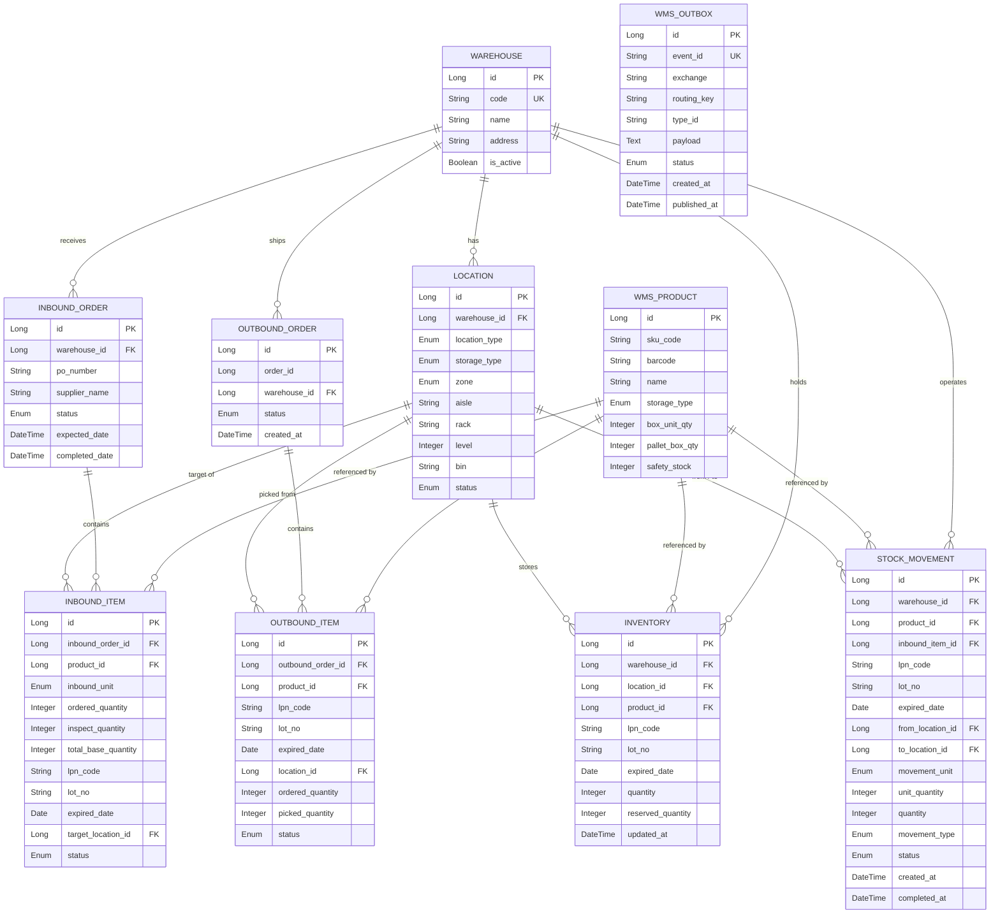

# WMS 서비스 ERD 명세

창고 관리 시스템(WMS)의 데이터 모델 정의서입니다. 입고(Inbound) → 적치/보충(StockMovement) → 재고 현행화(Inventory) → 출고(Outbound)의 물류 흐름을 LOT/유통기한(FEFO) 기준으로 관리합니다.

- DBMS: PostgreSQL (로컬 포트 `5437`, service number `5`)
- 이벤트 발행: Transactional Outbox → RabbitMQ (이 저장소의 다른 서비스들과 동일하게 Kafka가 아니라 RabbitMQ만 쓴다 — `common` 모듈이 `spring-boot-starter-amqp`를 제공)
- 재고 정합성: 낱개(EA) 단위로 현행화, 현장 작업은 파레트/박스 단위로 수행 후 환산

## 설계 원칙

- **상품 도메인 결합도 최소화**: 상품 도메인의 Product를 직접 참조하지 않고 `WmsProduct` 스냅샷을 둔다. `WmsProduct.id`는 상품 서비스의 Product UNIT ID와 동일한 값을 사용한다.
- **단위 환산**: 현장은 `PALLET`/`BOX(CARTON)` 단위로 검수·이동하고, 재고(`Inventory`)에는 항상 낱개(EA)로 반영한다. 환산 계수는 `WmsProduct.box_unit_qty`, `WmsProduct.pallet_box_qty`를 사용한다.
- **FEFO(First Expired, First Out)**: 출고 할당 및 재고 이동 시 `expired_date ASC` 기준으로 LOT을 선택한다. LOT 식별은 `(product_id, lot_no, expired_date, lpn_code)` 조합으로 한다.
- **로케이션 계층**: 버퍼(임시 도크) -> 보관존(파레트 랙) → 피킹존(선반 빈)  를 하나의 `Location` 테이블에서 `location_type`으로 구분한다.

## ER 다이어그램

---

## 1. WmsProduct — WMS용 상품 스냅샷

상품 도메인과 결합도를 낮추고, 입고 검수 및 재고 관리에 필요한 물리적 규격(바코드, 박스/파레트 단위)을 관리하기 위한 WMS 전용 마스터.

| 컬럼 | 타입 | 제약 | 설명 |
| --- | --- | --- | --- |
| `id` | Long | PK | 상품 ID (상품 도메인 Product UNIT ID와 동일한 값) |
| `sku_code` | String(50) | UK | 고유 상품 코드 |
| `barcode` | String(50) | | 입고 검수 시 스캔용 바코드 |
| `name` | String | | 상품명 |
| `storage_type` | Enum | | 보관 유형 (`REFRIGERATED` 냉장 / `FROZEN` 냉동 / `ROOM_TEMPERATURE` 상온) |
| `box_unit_qty` | Integer | | 박스당 낱개 수 (예: 10) |
| `pallet_box_qty` | Integer | | 파레트당 박스 수 (예: 40) |
| `safety_stock` | Integer | | 안전 재고 (낱개 기준) |

**포장 단위 계층**

- 일반: `파레트 → 박스 → 낱개`, 파레트당 낱개 = `pallet_box_qty × box_unit_qty`
- 박스 없이 파레트에 직접 적재되는 상품(예: 쌀): `box_unit_qty = 1`로 설정하여 환산식을 일관되게 유지한다. (`pallet_box_qty`가 파레트당 낱개 수 역할)

---

## 2. Warehouse — 물류 센터

물류 센터 기본 정보 관리.

| 컬럼 | 타입 | 제약 | 설명 |
| --- | --- | --- | --- |
| `id` | Long | PK | 물류 센터 식별자 |
| `code` | String(50) | UK | 센터 코드 (예: `ICN_01`) |
| `name` | String | | 센터 이름 (예: 김포 물류센터) |
| `address` | String | | 주소 |
| `is_active` | Boolean | | 운영 여부 |

---

## 3. Location — 로케이션 계층 구조

파레트 보관 구역(`PALLET_RACK`), 소분/선반 피킹 구역(`SHELF_BIN`), 임시 도크/버퍼(`BUFFER`)를 계층적으로 관리.

| 컬럼 | 타입 | 제약 | 설명 |
| --- | --- | --- | --- |
| `id` | Long | PK | 로케이션 식별자 |
| `warehouse_id` | Long | FK → Warehouse | 물류 센터 ID |
| `location_type` | Enum | | 로케이션 유형 (`PALLET_RACK` / `SHELF_BIN` / `BUFFER`) |
| `storage_type` | Enum | | 보관 유형 (`REFRIGERATED` / `FROZEN` / `ROOM_TEMPERATURE`) |
| `zone` | Enum | | 기능적 구역 (`BUFFER` / `PICKING` / `STORAGE`). `location_type`과 지금은 1:1로 겹치지만(STORAGE=PALLET_RACK, PICKING=SHELF_BIN, BUFFER=BUFFER), 한 구역에 여러 location_type이 섞이는 시점부터 별도 컬럼의 의미가 생겨 지금부터 분리해 둠 |
| `aisle` | String(20) | | 통로 번호 (기존 `rack` 보완). 예: `A01`(A01 열), `B02`(B02 열) |
| `rack` | String(20) | | 베이 번호 (기둥 사이 연 번호). 예: `03`(3번째 기둥 구역), `01`(1번째 기둥 구역) |
| `level` | Integer | | 층수 (파레트 랙 단수 관리용) |
| `bin` | String(20) | | 보관존(파레트): `01`, `02` / 피킹존(바구니): `F01`~`F09` (선반 내 3×3 격자 바구니) |
| `status` | Enum | | 상태 (`ACTIVE` 사용중 / `LOCKED` 점검·실사중). 점유 여부는 이 상태로 표현하지 않음 |

**주소 체계 유니크 제약**: `(warehouse_id, aisle, rack, level, bin)` 조합 UK.

**미결 사항**

- 파레트 단위와 선반 단위의 주소 체계를 명확히 확정해야 함.
- 하나의 랙에 여러 선반이 존재할 수 있음 → 선반 로케이션 세분화 필요.
- 원래 파레트 1개 자리에 선반이 여러 개 들어가는 구조인지 확인 필요.

---

## 4. InboundOrder — 입고 전표 (SCM 연계)

SCM 서비스로부터 전달받는 발주 및 입고 예정 정보.

| 컬럼 | 타입 | 제약 | 설명 |
| --- | --- | --- | --- |
| `id` | Long | PK | 입고 전표 식별자 |
| `warehouse_id` | Long | FK → Warehouse | 입고될 물류 센터 ID |
| `po_number` | String(50) | NOT NULL | SCM 발주 번호 (PO 단위 조회·추적용, `V2` 마이그레이션에서 추가) |
| `supplier_name` | String | | 공급사/벤더명 (SCM 연계) |
| `status` | Enum | | 전표 상태 (`EXPECTED` 입고예정 / `INSPECTING` 검수중 / `COMPLETED` 입고완료 / `CANCELED` 취소) |
| `expected_date` | DateTime | | 입고 예정 일시 |
| `completed_date` | DateTime | | 실제 입고 완료 일시 |

**미결 사항**: 임시 도크/버퍼(`BUFFER`)에 하차만 된 상태를 별도 상태값으로 추가할지 검토.

---

## 5. InboundItem — 입고 상세 품목 (단위 환산 및 LOT 포함)

현장 작업 단위(파레트/박스)로 검수하고, 최종 낱개(EA)로 환산하여 LOT/유통기한과 함께 기록하는 상세 내역.

| 컬럼 | 타입 | 제약 | 설명 |
| --- | --- | --- | --- |
| `id` | Long | PK | 입고 상세 식별자 |
| `inbound_order_id` | Long | FK → InboundOrder | 입고 전표 ID |
| `product_id` | Long | FK → WmsProduct | 상품 ID |
| `inbound_unit` | Enum | | 입고 작업 단위 (`PALLET` / `CARTON` / `BOX`) |
| `ordered_quantity` | Integer | | 발주/예정 수량 (입고 단위 기준) |
| `inspect_quantity` | Integer | | 실제 검수 합격 수량 (입고 단위 기준) |
| `total_base_quantity` | Integer | | 재고 반영용 최종 낱개(EA) 수량. `inspect_quantity × (WmsProduct 환산 계수)` |
| `lpn_code` | String(50) | | 물류용 바코드 (License Plate Number) |
| `lot_no` | String(50) | | LOT 번호 |
| `expired_date` | Date | | 유통기한 (FEFO의 핵심 기준) |
| `target_location_id` | Long | FK → Location | 적치할 목표 로케이션 ID |
| `status` | Enum | | 상세 상태 (`PENDING` / `INSPECTED` 검수완료 / `PUT_AWAY` 적치완료) |

> `unit_per_quantity`(단위당 낱개 수) 컬럼은 제거. 환산 계수는 `WmsProduct`에서 조회한다.
> - `inbound_unit = PALLET` → `× pallet_box_qty × box_unit_qty`
> - `inbound_unit = CARTON`/`BOX` → `× box_unit_qty`

---

## 6. Inventory — 실시간 재고 현행화 (LOT 및 FEFO 지원)

특정 창고·로케이션·상품, 그리고 유통기한(LOT)별로 분리된 실시간 가용/예약 재고 상태.

| 컬럼 | 타입 | 제약 | 설명 |
| --- | --- | --- | --- |
| `id` | Long | PK | 재고 식별자 |
| `warehouse_id` | Long | FK → Warehouse | 물류 센터 ID |
| `location_id` | Long | FK → Location | 로케이션 ID |
| `product_id` | Long | FK → WmsProduct | 상품 ID |
| `lpn_code` | String(50) | | 물류용 바코드 |
| `lot_no` | String(50) | | LOT 번호 |
| `expired_date` | Date | | 유통기한 (FEFO 정렬/조회 기준) |
| `quantity` | Integer | `CHECK (quantity >= 0)` | 가용 재고 수량 (낱개 기준) |
| `reserved_quantity` | Integer | `CHECK (reserved_quantity >= 0)` | 주문 선점 예약 수량 |
| `updated_at` | DateTime | | 최종 재고 변동 일시 |

**UK 제약**: `(warehouse_id, location_id, product_id, lot_no, expired_date, lpn_code)`

**조회 시**: 상품 전체 가용 재고 = `SUM(quantity - reserved_quantity)` (해당 상품의 전 로케이션 합산).

---

## 7. StockMovement — 재고 이동 및 물류 작업 지시

입고 후 적치(`PUT_AWAY`), 피킹존 재고 보충(`REPLENISHMENT`), 단순 로케이션 이동(`RELOCATION`) 등 창고 내 모든 물리적 이동을 관리하는 작업 지시 테이블.

| 컬럼 | 타입 | 제약 | 설명 |
| --- | --- | --- | --- |
| `id` | Long | PK | 이동/작업 지시 식별자 |
| `warehouse_id` | Long | FK → Warehouse | 물류 센터 ID |
| `product_id` | Long | FK → WmsProduct | 상품 ID |
| `inbound_item_id` | Long | FK → InboundItem, NULL 허용 (V4) | PUT_AWAY가 입고 검수 건에서 비롯된 경우에만 채워짐. put-away/confirm이 "이 검수 건의 대기 중인 작업 지시"를 로케이션 매칭 없이 직접 찾기 위한 참조 — 작업자가 추천과 다른 로케이션에 실제로 적치할 수 있어 location 기준 매칭은 신뢰할 수 없다. REPLENISHMENT/RELOCATION은 NULL |
| `lpn_code` | String(50) | | 물류용 바코드 |
| `lot_no` | String(50) | | 대상 LOT 번호 (FEFO 고려) |
| `expired_date` | Date | | 유통기한 (FEFO 정렬/조회 기준) |
| `from_location_id` | Long | FK → Location | 출발지 로케이션 (예: 임시 버퍼, 파레트 랙) |
| `to_location_id` | Long | FK → Location | 목적지 로케이션 (예: 파레트 랙, 피킹 선반) |
| `movement_unit` | Enum | | 현장 작업 단위 (`PALLET` / `BOX` / `EA`) |
| `unit_quantity` | Integer | | 작업 단위 기준 수량 (예: `2` = 2 파레트) |
| `quantity` | Integer | | 이동할 낱개(EA) 수량 |
| `movement_type` | Enum | | 이동 유형 (`PUT_AWAY` 입고적치 / `REPLENISHMENT` 피킹존보충 / `RELOCATION` 단순이동) |
| `status` | Enum | | 작업 상태 (`PENDING` 지시생성 / `IN_PROGRESS` 작업중 / `COMPLETED` 완료 / `CANCELED` 취소) |
| `created_at` | DateTime | | 작업 지시 생성 일시 |
| `completed_at` | DateTime | | 작업 완료 일시 |

---

## 8. OutboundOrder — 출고 전표 (OMS 연계)

OMS(주문 관리 시스템)로부터 전달받은 출고 지시 전표.

| 컬럼 | 타입 | 제약 | 설명 |
| --- | --- | --- | --- |
| `id` | Long | PK | 출고 전표 식별자 |
| `order_id` | Long | | 프론트오피스 주문 ID (OMS/주문 도메인 연계) |
| `warehouse_id` | Long | FK → Warehouse | 출고 담당 물류 센터 ID |
| `status` | Enum | | 전표 상태 (`ALLOCATED` 재고할당완료 / `PICKING` 피킹중 / `PACKING` 포장중 / `COMPLETED` 출고완료 / `CANCELED` 취소) |
| `created_at` | DateTime | | 출고 지시 생성 일시 |

---

## 9. OutboundItem — 출고 상세 품목 (FEFO 재고 할당)

주문된 상품을 FEFO(`ORDER BY expired_date ASC`) 방식으로 어떤 재고(LOT/로케이션)에서 차감할지 지정하는 상세 내역.

| 컬럼 | 타입 | 제약 | 설명 |
| --- | --- | --- | --- |
| `id` | Long | PK | 출고 상세 식별자 |
| `outbound_order_id` | Long | FK → OutboundOrder | 출고 전표 ID |
| `product_id` | Long | FK → WmsProduct | 상품 ID |
| `lpn_code` | String(50) | | 물류용 바코드 |
| `lot_no` | String(50) | | FEFO에 의해 할당된 대상 LOT 번호 |
| `expired_date` | Date | | 할당된 재고의 유통기한 |
| `location_id` | Long | FK → Location | 피킹할 출발지 로케이션 (주로 `SHELF_BIN`) |
| `ordered_quantity` | Integer | | 주문 요청 수량 (EA) |
| `picked_quantity` | Integer | | 실제 피킹 완료 수량 (EA) |
| `status` | Enum | | 상세 상태 (`PENDING` / `PICKED` / `SHORTAGE` 결품) |

---

## 10. WmsOutbox — Transactional Outbox 패턴

비즈니스 로직과 RabbitMQ 이벤트 발행의 원자성(Atomicity) 보장. 원래 erd-spec에는 범용
`aggregate_type`/`aggregate_id`/`event_type` 설계(Kafka 전제)로 있었으나 실제 발행자가
하나도 없었고, 이 저장소는 RabbitMQ만 쓰기 때문에 product-service가 이미 검증한
RabbitMQ 발행용 스키마(`product_outbox`)를 그대로 재사용하는 편이 낫다고 보고 교체했다
(`V5__replace_outbox_with_wms_outbox.sql`, 2026-09-16). 테이블명도 `wms_outbox`로 바뀌었다.

| 컬럼 | 타입 | 제약 | 설명 |
| --- | --- | --- | --- |
| `id` | Long | PK | 이벤트 식별자 |
| `event_id` | String(36) | UK | 이벤트 UUID (페이로드에도 같은 값이 실림) |
| `exchange` | String(100) | | 발행 대상 익스체인지 (예: `wms.topic.exchange`) |
| `routing_key` | String(200) | | 라우팅 키 (예: `wms.inbound.completed`) |
| `type_id` | String(300) | | 페이로드 클래스의 FQCN. RabbitMQ `__TypeId__` 헤더 값으로 그대로 실린다 |
| `payload` | Text | | 이벤트 JSON 문자열 |
| `status` | Enum | | 발행 상태 (`PENDING` / `PUBLISHED`) |
| `created_at` | DateTime | | 생성 일시 |
| `published_at` | DateTime | | 발행 완료 일시 (브로커 ACK 수신 시점) |

---

## Enum 정의 요약

| Enum | 값 | 사용 테이블 |
| --- | --- | --- |
| `StorageType` | `REFRIGERATED`, `FROZEN`, `ROOM_TEMPERATURE` | WmsProduct, Location |
| `LocationType` | `PALLET_RACK`, `SHELF_BIN`, `BUFFER` | Location |
| `LocationStatus` | `ACTIVE`, `LOCKED` | Location |
| `Zone` | `BUFFER`, `PICKING`, `STORAGE` | Location |
| `InboundOrderStatus` | `EXPECTED`, `INSPECTING`, `COMPLETED`, `CANCELED` | InboundOrder |
| `InboundUnit` | `PALLET`, `CARTON`, `BOX` | InboundItem |
| `InboundItemStatus` | `PENDING`, `INSPECTED`, `PUT_AWAY` | InboundItem |
| `MovementUnit` | `PALLET`, `BOX`, `EA` | StockMovement |
| `MovementType` | `PUT_AWAY`, `REPLENISHMENT`, `RELOCATION` | StockMovement |
| `MovementStatus` | `PENDING`, `IN_PROGRESS`, `COMPLETED`, `CANCELED` | StockMovement |
| `OutboundOrderStatus` | `ALLOCATED`, `PICKING`, `PACKING`, `COMPLETED`, `CANCELED` | OutboundOrder |
| `OutboundItemStatus` | `PENDING`, `PICKED`, `SHORTAGE` | OutboundItem |
| `OutboxStatus` | `PENDING`, `PUBLISHED` | WmsOutbox |

---

## 논의 필요 사항 (Open Questions)

1. **전체 재고 집계**: 동일 상품 재고가 로케이션별로 분산 관리됨. 전체 재고 조회 시 로케이션별 재고를 합산(`SUM(quantity - reserved_quantity)`)해서 응답하는 방식으로 확정 필요. 별도 상품 단위 집계 테이블/캐시를 둘지 여부 검토.
2. **재고 선점(예약) 시점과 대상**: 특정 마감 시각까지 주문을 모았다가 피킹을 시작하는 구조. 마감 전에는 실물 재고가 확정되지 않는데 `reserved_quantity`를 언제 증가시킬지 확정 필요. 선점 시 보관존 재고까지 포함해 차감 대상으로 볼지, 피킹존 가용 재고만 대상으로 볼지 결정 필요.
3. **마감 전 주문 보관 위치**: 마감 전 주문을 MQ(Kafka)에 적재해 두는지, WMS 내부 임시 테이블에 쌓는지 결정 필요. (재처리·조회 요구사항에 따라 달라짐)
4. **로케이션 배정 전략**: 보관존(STORAGE) 입고 적치는 동적 배정으로 1차 구현 완료 — `InboundOrderService.recommendStorageLocation()`이 같은 warehouse/storageType의 PALLET_RACK 중 유효 재고 없음 + 진행 중인 이동 지시 미선점인 로케이션을 aisle/rack/level/bin 오름차순으로 1건 추천하고, 없으면 `WMS409`(`NO_AVAILABLE_LOCATION`)를 던진다. 상품별 지정 로케이션(고정 슬롯) 방식과의 하이브리드 여부, 그리고 피킹존(PICKING) 보충(REPLENISHMENT) 배정 전략은 여전히 미결.
5. **InboundOrder 상태 확장**: 버퍼 하차 완료 상태를 별도 상태로 추가할지.
